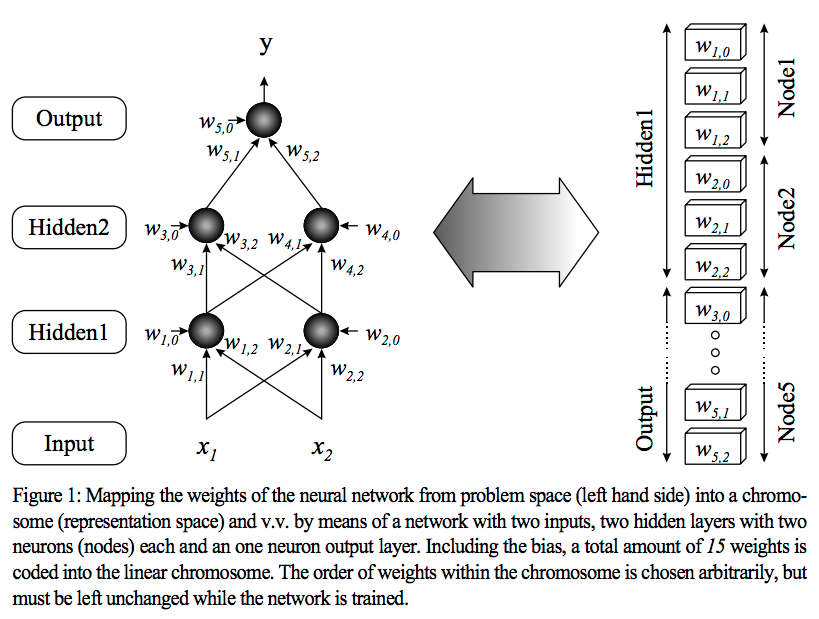
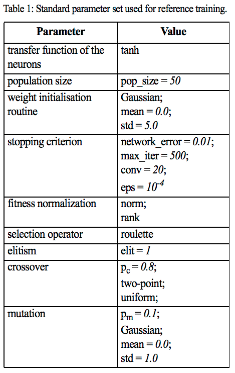
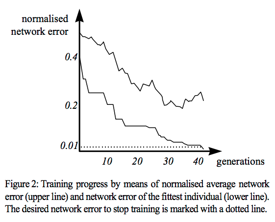

## Multiple Layer Perceptron Training Using Genetic Algorithms

[Artigo Referência](artigo_ref.pdf)

### Introdução

Treinamentos utilizando Perceptron de múltiplas camadas com o algoritmo de retropropagação é muito utilizado para solução de problemas do mundo real. Várias sugestões foram feitas para evitar que o algoritmo do gradiente descendente seja capturado em qualquer mínimo local quando se deslocam através da superfície de erro. A proposta deste artigo é a substituição deste comportamento por um algoritmo genético.

### Motivação

O algoritmo de gradiente descendente, apesar de funcionar bem para o treinamento de redes neurais, possui algumas desvantagens tais como a dependência da forma da curva de erro, ponto de início (valores dos pesos geralmente inicializados aleatoriamente), dentre outros. Essas desvantagens podem acarretar em alguns problemas visto que a superfície de erro geralmente possui muitos mínimos locais, fazendo com que o algoritmo do gradiente não atinja o critério de convergência desejado.
Existem métodos para evitar que isto aconteça, tais como a introdução de um termo de _momentum_ (útil para pontos de alta curvatura) e a utilização de uma taxa de aprendizado decrescente sincronizada. Uma vez que o sistema esteja preso em qualquer mínimo local, os pesos podem ser movimentados; um pequeno deslocamento aleatório é adicionado antes que a próxima iteração continue. No entanto, tudo isso não é capaz de realmente superar os muitos problemas existentes.

Algoritmos genéticos (GA) oferecem um método de busca eficiente para um espaço de problema complexo e podem ser usados ​​como poderosas ferramentas de otimização. Com relação aos problemas anteriores a respeito do gradiente descendente, uma substituição completa por um GA pode trazer alguns benefícios. Além da otimização do projeto de redes neurais usando algoritmos genéticos, esta é outra associação muito interessante e biologicamente motivada de redes neurais artificiais e computação evolucionária.

### Implementação

A fim de obter uma representação cromossômica apropriada dos pesos da rede, eles devem ser inicializados aleatoriamente várias vezes e, consequentemente, codificados em uma estrutura linear. Cada cromossomo (individual) representa um conjunto de pesos neurais (Figura 1). Como a arquitetura da rede neural é pré-definida e permanece fixa após a inicialização, o cromossomo consiste apenas nos valores de peso e não contém nenhuma informação topológica ou estrutural. Todos esses indivíduos representam a população inicial.

Agora, a função de adequação de cada membro da população atual é calculada realizando um recall da rede para cada conjunto de pesos. Para corresponder à topologia da rede, todos os cromossomos precisam ser decodificados novamente. Se houver um resultado de recall satisfazendo o critério de qualidade exigido, definido pelo erro geral da rede, o processo é interrompido. Caso contrário, as operações genéticas usando o operador de reprodução e / ou seleção são executadas para formar uma população intermediária. Finalmente, uma nova população é gerada aplicando-se crossover e talvez mutação a essa população intermediária. Um novo ciclo de iteração começa novamente com o cálculo das funções de adequação.

Ao selecionar parâmetros adequados para controlar o GA, é possível obter alta eficiência e bom desempenho. A rede neural é executada apenas no modo de rechamada, que pode ser facilmente implementada e garante uma adaptação bastante simples a qualquer demanda em seu comportamento feita pela tarefa a ser resolvida. No longo prazo, pelo menos um indivíduo deve atender ao critério de parada (convergência). Isso representa o conjunto de pesos da rede melhor treinada. Isso pode ser aplicado ao problema real da mesma forma que foi treinado pela retropropagação ou por qualquer outra sequência de aprendizado. De agora em diante, não importa como a rede foi realmente treinada.

### Resultados
##### Função XOR

Com base em uma infinidade de experimentos avaliando diferentes parâmetros para controlar o algoritmo genético, um conjunto padrão foi definido (Tabela 1). 

Para poder resolver o xor de dois bits, o tamanho da rede foi definido para 2 entradas, 2 neurônios no oculto e 1 na camada de saída com uma função de transferência sigmóide. Inicialmente, 50 conjuntos de pesos foram criados e codificados em cromossomos correspondentes. O critério de parada é uma combinação do erro de rede durante o recall e um número máximo de gerações. O erro de recordação de rede normalizado médio (valor médio dos erros de recordação médios que usam o conjunto de dados de treinamento completo (4 exemplos) de todos os 50 cromossomos) da população inicial é aproximadamente 0.5. O indivíduo mais apto da população inicial tem um erro de cerca de 0,4. Após 42 gerações, o erro fica abaixo do limiar desejado e o treinamento é interrompido com um erro de 0,0061.

A Figura 2 mostra o progresso do treinamento desse exemplo de característica selecionado. Este resultado deve ser comparado com uma rede convencionalmente treinada do mesmo tamanho e sob circunstâncias comparáveis ​​(velocidade de computação, detalhes de implementação). Algumas considerações: 

- Nem a retropropagação (após algumas reinicializações) nem o algoritmo genético tiveram problemas para resolver esse problema específico de teste.
- A rede de retropropagação precisa de significativamente mais ciclos de iteração (proporção de aproximadamente 50: 1 ... 100:1, dependendo do peso inicializado.
- Cada iteração é executada de maneira consideravelmente mais rápida que uma geração do algoritmo evolucionário (proporção aprox. 1:20 ... 1:50)
- Segue-se que o GA finalmente tem um avanço de velocidade de no máx. 5:1 sobre a retropropagação. Também há casos em que a retropropagação supera o algoritmo genético em 2:1 ... 4:1.

##### Redes maiores

Este exemplo xor simples demonstra propriedades básicas e manipulação do MLP evolucionário. Pode-se esperar ainda que as vantagens se tornem ainda mais evidentes ao lidar com redes maiores e problemas mais complexos. Quanto mais ponderações otimizar durante o treinamento da rede, maior será a dimensão da superfície de erro correspondente. Juntamente com o erro muitas vezes mais robusto, o risco de ficar preso dentro de um mínimo local aumenta. Como um algoritmo genético não sofre com isso, ele ainda deve manter uma performace razoavel com redes maiores.

### Conclusão

A associação de redes neurais artificiais e algoritmos genéticos não é realmente uma ideia nova. No entanto, vale a pena investigar o uso de algoritmos genéticos no treinamento de redes neurais, particularmente se alguns inconvenientes do treinamento de redes neurais puderem ser evitados. Na verdade, o algoritmo de retropropagação para o treinamento de perceptrons de múltiplas camadas às vezes encontra alguns problemas sérios e sua completa substituição por um algoritmo genético pode ser uma solução muito promissora. As principais questões que este artigo estava focalizando são em quais circunstâncias isso pode ser útil e como uma implementação adequada pode ser alcançada e tratada.

Supondo que tanto a retropropagação quanto os algoritmos genéticos são executados com parâmetros quase ótimos sob condições comparáveis, a retropropagação supera os algoritmos genéticos no caso de aplicações padrão simples. Considerando todos os aspectos, incluindo tempo de simulação, parâmetros de localização e manuseio, conhecimento prévio necessário e disponibilidade de software, não há necessidade de substituir o algoritmo de treinamento de retropropagação bem testado e confiável.

Mas assim que os problemas a serem resolvidos estão ficando mais complexos, a retropropagação falha cada vez mais devido à sua descida de gradiente inerente. A retropropagação precisa, nesses casos, de várias iniciações com pesos iniciais variáveis para atender ao erro desejado ou não é capaz de resolver a tarefa necessária, enquanto os algoritmos genéticos ainda estão funcionando muito bem.

No campo dos algoritmos genéticos, os resultados apresentados neste trabalho mostram o importante dualismo entre o comprimento do cromossomo, dependendo do número de pesos a serem codificados, e o número médio de gerações necessárias. Quanto mais tempo os cromossomos, mais gerações são necessárias. Em geral, os algoritmos genéticos são inerentemente mais lentos que a retropropagação. Isso pode ser esperado devido à sua técnica de busca global comparada com o aprendizado de inclinação descendente altamente direcionado da retropropagação. Mas mesmo isso torna valioso e útil nesses casos a BP falha.

Além disso, a chance de usar qualquer função de transferência para os neurônios, sem estar vinculada à demanda por uma função diferenciável, também pode ser vantajoso considerar a substituição da retropropagação por um algoritmo genético.